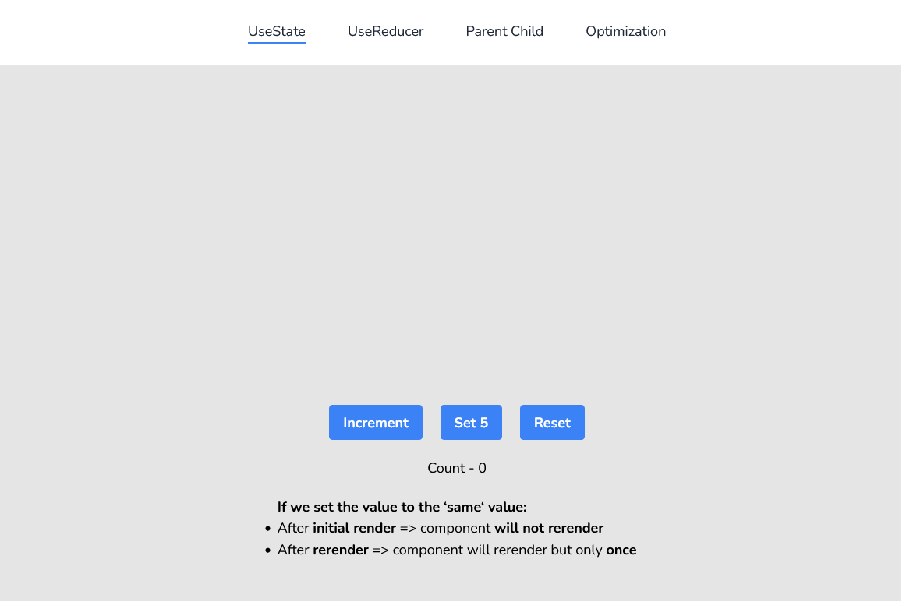

# React Render Practice - Nextjs v13.4.1

This is a practical [Next.js](https://nextjs.org/) project bootstrapped with [`create-next-app`](https://github.com/vercel/next.js/tree/canary/packages/create-next-app) for practicing **React Render Behaviour**. This project is my practice for [React-Render Course](https://www.youtube.com/watch?v=YP2f-ErXG_M&list=PLC3y8-rFHvwg7czgqpQIBEAHn8D6l530t) from [Codevolution Channel](https://www.youtube.com/@Codevolution/)
.

Explore the [demo](https://maxjn-react-render.vercel.app/) for better understanding'. With every render, it logs to the console so you can practice React rendering behavior easily.

## Technologies

- TSX, Tailwindcss,
- TypeScript
- **Nextjs v13.4.1**

## Features

- Render Behaviour with:
  - useState hook
  - useReducer hook
  - Parent Child component
  - Optimization

## Installation

###### shell command

```shell
npm install

npm run dev
```

## Screenshots


